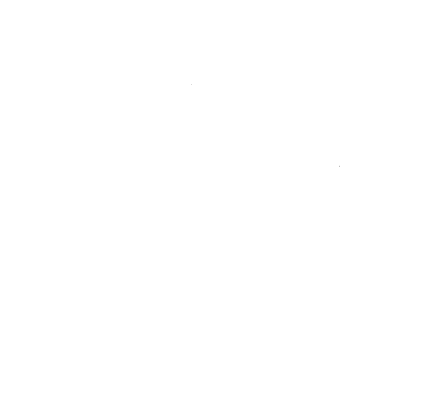

```{=html}
<style>
  :root {
    --blue-ufpa: #002C6F;
    --blue-ufpa-dark: #001B45;
    --red-ufpa: #E4002B;
    --gold-ufpa: #B29600;
    --ink: #231F20;
    --muted: #5A6472;
    --line: #E2E5EA;
  }

  /* ===== HERO ===== */
  .sn-hero {
    position: relative;
    overflow: hidden;
    background: linear-gradient(115deg, var(--blue-ufpa-dark) 0%, var(--blue-ufpa) 55%, #013a8a 100%);
    border-radius: 8px;
    color: #FFFFFF;
    margin: 0.4rem 0 2.4rem 0;
    padding: 2.6rem 2.4rem;
    display: flex;
    align-items: center;
    gap: 2rem;
    flex-wrap: wrap;
  }

  .sn-hero-text {
    position: relative;
    z-index: 2;
    flex: 1 1 380px;
    min-width: 280px;
  }

  .sn-hero-text h1 {
    font-size: 2.2rem;
    font-weight: 800;
    margin: 0 0 0.4rem 0;
    color: #FFFFFF !important;
    line-height: 1.15;
  }

  .sn-hero-text .sn-hero-subtitle {
    font-size: 1.05rem;
    font-weight: 600;
    color: #CFE0FF;
    margin: 0 0 1rem 0;
  }

  .sn-hero-text p {
    color: #E7EDFA;
    font-size: 0.98rem;
    line-height: 1.6;
    max-width: 46ch;
    margin: 0 0 1.4rem 0;
  }

  .sn-hero-text p a {
    color: #FFFFFF;
    text-decoration: underline;
  }

  .sn-hero-links {
    display: flex;
    flex-wrap: wrap;
    gap: 0.6rem;
    margin-bottom: 1.6rem;
  }

  .sn-hero-links a {
    display: inline-block;
    padding: 0.45rem 0.9rem;
    background: rgba(255,255,255,0.08);
    border: 1px solid rgba(255,255,255,0.35);
    border-radius: 20px;
    color: #FFFFFF !important;
    font-size: 0.85rem;
    font-weight: 600;
    text-decoration: none !important;
    transition: background 0.15s ease;
  }

  .sn-hero-links a:hover {
    background: rgba(255,255,255,0.2);
  }

  .sn-hero-stats {
    display: flex;
    flex-wrap: wrap;
    gap: 2rem;
    padding-top: 1.2rem;
    border-top: 1px solid rgba(255,255,255,0.25);
  }

  .sn-hero-stats .stat-num {
    font-size: 1.5rem;
    font-weight: 800;
    color: #FFFFFF;
    line-height: 1.1;
  }

  .sn-hero-stats .stat-label {
    font-size: 0.82rem;
    color: #CFE0FF;
  }

  .sn-hero-art {
    position: relative;
    z-index: 1;
    flex: 1 1 260px;
    min-width: 220px;
    max-width: 380px;
    align-self: stretch;
    display: flex;
    align-items: center;
    justify-content: center;
  }

  .sn-hero-art svg { width: 100%; height: auto; }

  @media (max-width: 720px) {
    .sn-hero-art { display: none; }
  }

  /* ===== SECTION HEADERS ===== */
  .sn-section {
    margin: 2.4rem 0;
  }

  .sn-section-title {
    font-size: 1.5rem;
    font-weight: 800;
    color: var(--ink);
    margin: 0 0 1.1rem 0;
  }

  /* ===== FEATURED CARD (Destaque) ===== */
  .sn-feature {
    display: flex;
    gap: 1.6rem;
    align-items: center;
    flex-wrap: wrap;
    border: 1px solid var(--line);
    border-radius: 8px;
    padding: 1.4rem 1.6rem;
    background: #FBFCFE;
  }

  .sn-feature img {
    width: 92px;
    height: 92px;
    object-fit: contain;
    flex-shrink: 0;
    background: var(--blue-ufpa);
    border-radius: 6px;
    padding: 0.5rem;
  }

  .sn-tag {
    display: inline-block;
    font-size: 0.72rem;
    text-transform: uppercase;
    letter-spacing: 0.04em;
    font-weight: 700;
    padding: 0.15rem 0.55rem;
    border-radius: 3px;
    margin-bottom: 0.5rem;
  }

  .sn-tag-azul { color: var(--blue-ufpa); background: #E7EEFA; }
  .sn-tag-vermelho { color: var(--red-ufpa); background: #FCE7EB; }
  .sn-tag-dourado { color: var(--gold-ufpa); background: #FBF3D9; }

  .sn-feature h3 { font-size: 1.15rem; color: var(--ink); margin: 0 0 0.6rem 0; }
  .sn-feature p { color: var(--muted); line-height: 1.6; margin: 0; }
  .sn-feature p a { color: var(--blue-ufpa); font-weight: 600; }

  /* ===== CARD GRID ===== */
  .sn-card-grid {
    display: grid;
    grid-template-columns: repeat(auto-fill, minmax(230px, 1fr));
    gap: 1.1rem;
  }

  .sn-card {
    display: flex;
    flex-direction: column;
    border: 1px solid var(--line);
    border-radius: 8px;
    overflow: hidden;
    text-decoration: none !important;
    background: #FFFFFF;
    transition: box-shadow 0.15s ease, transform 0.15s ease;
  }

  .sn-card:hover {
    box-shadow: 0 6px 18px rgba(0,44,111,0.12);
    transform: translateY(-2px);
  }

  .sn-card-thumb {
    height: 108px;
    display: flex;
    align-items: center;
    justify-content: center;
  }

  .sn-card-thumb svg { width: 46px; height: 46px; }

  .sn-card-body { padding: 0.9rem 1.05rem 1.15rem 1.05rem; }

  .sn-card-body h4 {
    font-size: 1rem;
    font-weight: 700;
    color: var(--ink);
    margin: 0.15rem 0 0.4rem 0;
  }

  .sn-card-body p {
    font-size: 0.86rem;
    color: var(--muted);
    line-height: 1.5;
    margin: 0;
  }

  /* ===== COLLECTION CARDS ===== */
  .sn-collection-grid {
    display: grid;
    grid-template-columns: repeat(auto-fill, minmax(260px, 1fr));
    gap: 1.1rem;
  }

  .sn-collection-card {
    display: block;
    border: 1px solid var(--line);
    border-radius: 8px;
    padding: 1.2rem 1.3rem;
    text-decoration: none !important;
    background: #FFFFFF;
    transition: box-shadow 0.15s ease, transform 0.15s ease;
  }

  .sn-collection-card:hover {
    box-shadow: 0 6px 18px rgba(0,44,111,0.12);
    transform: translateY(-2px);
  }

  .sn-collection-card h4 {
    font-size: 1.02rem;
    font-weight: 700;
    color: var(--ink);
    margin: 0 0 0.5rem 0;
  }

  .sn-collection-card p {
    font-size: 0.86rem;
    color: var(--muted);
    line-height: 1.5;
    margin: 0;
  }
</style>
```

```{=html}
<!-- ===== HERO ===== -->
<div class="sn-hero">
  <div class="sn-hero-text">
    <p> Site pessoal do Prof. Raphael Teixeira, de suporte para suas atividades de ensino e pesquisa em Engenharia Elétrica na UFPA — Campus de Tucuruí: <a href="https://fee.camtuc.ufpa.br/">Engenharia Elétrica</a>.</p>
    <div class="sn-hero-links">
      <a href="Ensino/index.qmd">Ensino</a>
      <a href="Pesquisa/index.qmd">Pesquisa</a>
      <a href="Projetos/index.qmd">Projetos</a>
      <a href="Publicacoes/index.qmd">Publicações</a>
      <a href="LINCE/index.qmd">LINCE</a>
    </div>
    <div class="sn-hero-stats">
      <div>
        <div class="stat-num">4</div>
        <div class="stat-label">linhas de atuação</div>
      </div>
      <div>
        <div class="stat-num">7</div>
        <div class="stat-label">seções do site</div>
      </div>
      <div>
        <div class="stat-num">2</div>
        <div class="stat-label">coleções abertas (TikZ &amp; Manim)</div>
      </div>
    </div>
  </div>
  <div class="sn-hero-art" aria-hidden="true">
    <svg viewBox="0 0 460 400" xmlns="http://www.w3.org/2000/svg" font-family="Arial, Helvetica, sans-serif">
      <defs>
        <linearGradient id="heroStroke" x1="0" y1="0" x2="1" y2="1">
          <stop offset="0%" stop-color="#FFD700"/>
          <stop offset="100%" stop-color="#7FB2FF"/>
        </linearGradient>
      </defs>

      <!-- malha de fundo -->
      <g stroke="rgba(255,255,255,0.08)" stroke-width="1">
        <path d="M0 70H460M0 140H460M0 260H460M0 330H460"/>
        <path d="M60 0V400M150 0V400M310 0V400M400 0V400"/>
      </g>
      <circle cx="30" cy="30" r="2.5" fill="#7FB2FF" opacity="0.7"/>
      <circle cx="435" cy="380" r="2.5" fill="#7FB2FF" opacity="0.7"/>

      <!-- ===== Painel A: malha de controle clássica ===== -->
      <g fill="none" stroke="rgba(255,255,255,0.6)" stroke-width="1.6">
        <!-- entrada R(s) -->
        <path d="M18 100H55"/>
        <path d="M55 100l-7-4 0 8z" fill="rgba(255,255,255,0.6)" stroke="none"/>
        <!-- soma -> C(s) -->
        <path d="M81 100H109"/>
        <path d="M109 100l-7-4 0 8z" fill="rgba(255,255,255,0.6)" stroke="none"/>
        <!-- C(s) -> G(s) -->
        <path d="M181 100H214"/>
        <path d="M214 100l-7-4 0 8z" fill="rgba(255,255,255,0.6)" stroke="none"/>
        <!-- G(s) -> saída Y(s) -->
        <path d="M286 100H358"/>
        <path d="M358 100l-7-4 0 8z" fill="rgba(255,255,255,0.6)" stroke="none"/>
        <!-- realimentação: derivação da saída -->
        <path d="M336 100V150H219"/>
        <path d="M219 150l7-4 0 8z" fill="rgba(255,255,255,0.6)" stroke="none"/>
        <path d="M145 150H69"/>
        <path d="M69 150l7-4 0 8z" fill="rgba(255,255,255,0.6)" stroke="none"/>
        <path d="M69 150V113"/>
        <path d="M69 113l-4 7 8 0z" fill="rgba(255,255,255,0.6)" stroke="none"/>
      </g>

      <circle cx="336" cy="100" r="3" fill="#FFD700"/>

      <!-- junção de soma -->
      <circle cx="69" cy="100" r="12" fill="#001B45" stroke="rgba(255,255,255,0.6)" stroke-width="1.6"/>
      <text x="64" y="97" font-size="10" fill="#FFD700">+</text>
      <text x="58" y="107" font-size="11" fill="#FFD700">−</text>

      <rect x="110" y="80" width="70" height="40" rx="4" fill="#001B45" stroke="url(#heroStroke)" stroke-width="1.8"/>
      <text x="145" y="105" font-size="14" text-anchor="middle" fill="#FFFFFF">C(s)</text>

      <rect x="215" y="80" width="70" height="40" rx="4" fill="#001B45" stroke="url(#heroStroke)" stroke-width="1.8"/>
      <text x="250" y="105" font-size="14" text-anchor="middle" fill="#FFFFFF">G(s)</text>

      <rect x="145" y="132" width="70" height="36" rx="4" fill="#001B45" stroke="url(#heroStroke)" stroke-width="1.8"/>
      <text x="180" y="155" font-size="13" text-anchor="middle" fill="#FFFFFF">H(s)</text>

      <text x="6" y="90" font-size="12" fill="#CFE0FF">R(s)</text>
      <text x="362" y="105" font-size="12" fill="#CFE0FF">Y(s)</text>

      <!-- ===== Painel B: plano s / LGR ===== -->
      <g stroke="rgba(255,255,255,0.5)" stroke-width="1.3" fill="none">
        <path d="M40 290H424"/>
        <path d="M424 290l-8-4.5v9z" fill="rgba(255,255,255,0.5)" stroke="none"/>
        <path d="M230 368V222"/>
        <path d="M230 222l-4.5 8h9z" fill="rgba(255,255,255,0.5)" stroke="none"/>
      </g>
      <text x="410" y="303" font-size="12" fill="#CFE0FF">σ</text>
      <text x="238" y="230" font-size="12" fill="#CFE0FF">jω</text>

      <!-- lugar das raízes: G(s) = K / [s(s+4)] -->
      <path d="M140 290H230" stroke="#FFD700" stroke-width="2" fill="none"/>
      <path d="M185 290V226" stroke="#FFD700" stroke-width="2" fill="none"/>
      <path d="M185 290V354" stroke="#FFD700" stroke-width="2" fill="none"/>
      <path d="M185 226l-4.5 8h9z" fill="#FFD700"/>
      <path d="M185 354l-4.5-8h9z" fill="#FFD700"/>

      <!-- linhas de amortecimento constante (ζ) até o ponto de projeto -->
      <path d="M230 290L185 250" stroke="rgba(255,255,255,0.5)" stroke-width="1.2" stroke-dasharray="3 3" fill="none"/>
      <path d="M230 290L185 330" stroke="rgba(255,255,255,0.5)" stroke-width="1.2" stroke-dasharray="3 3" fill="none"/>

      <!-- polos em malha aberta (s=0 e s=-4) -->
      <g stroke="#FFFFFF" stroke-width="2">
        <path d="M225 285l10 10M235 285l-10 10"/>
        <path d="M135 285l10 10M145 285l-10 10"/>
      </g>
      <!-- ponto de "breakaway" -->
      <circle cx="185" cy="290" r="3" fill="#FFFFFF"/>
      <!-- polos de malha fechada escolhidos via LGR -->
      <circle cx="185" cy="250" r="4.5" fill="#FFD700"/>
      <circle cx="185" cy="330" r="4.5" fill="#FFD700"/>
    </svg>
  </div>
</div>
```

```{=html}
<!-- ===== DESTAQUE ===== -->
<div class="sn-section">
  <div class="sn-feature">
    
    <div>
      <span class="sn-tag sn-tag-vermelho">3 artigos aceitos</span>
      <h3>XXVI Congresso Brasileiro de Automática (CBA 2026)</h3>
      <p>Três artigos do grupo de pesquisa foram aceitos para apresentação e publicação nos anais do CBA 2026, em São Paulo (6 a 9 de outubro de 2026): dois sobre controle preditivo aplicado a sistema térmico e um sobre FCS-MPC com ARX adaptativo via RLS para controle P-Q de inversores trifásicos. Veja os detalhes em <a href="Publicacoes/index.qmd">Publicações</a>.</p>
    </div>
  </div>
</div>
```

```{=html}
<!-- ===== ÁREAS DO SITE ===== -->
<div class="sn-section">
  <div class="sn-section-title">Áreas do site</div>
  <div class="sn-card-grid">

    <a class="sn-card" href="Ensino/index.qmd">
      <div class="sn-card-thumb" style="background:#E7EEFA;">
        <svg viewBox="0 0 24 24" stroke="#002C6F" stroke-width="1.6" fill="none" stroke-linecap="round" stroke-linejoin="round">
          <path d="M12 3 2 8l10 5 10-5-10-5z"/>
          <path d="M6 10.5v4.5c0 1.5 3 3 6 3s6-1.5 6-3v-4.5"/>
          <path d="M22 8v6"/>
        </svg>
      </div>
      <div class="sn-card-body">
        <span class="sn-tag sn-tag-azul">Acadêmico</span>
        <h4>Ensino</h4>
        <p>Disciplinas de graduação em Engenharia Elétrica e do Mestrado em Computação, com slides, listas e material de apoio.</p>
      </div>
    </a>

    <a class="sn-card" href="Pesquisa/index.qmd">
      <div class="sn-card-thumb" style="background:#E7EEFA;">
        <svg viewBox="0 0 24 24" stroke="#002C6F" stroke-width="1.6" fill="none" stroke-linecap="round" stroke-linejoin="round">
          <circle cx="10" cy="10" r="6"/>
          <path d="M14.5 14.5 21 21"/>
          <path d="M7 11l2-3 2 2 3-4"/>
        </svg>
      </div>
      <div class="sn-card-body">
        <span class="sn-tag sn-tag-azul">Acadêmico</span>
        <h4>Pesquisa</h4>
        <p>Repositórios de pesquisa no GitHub, organizados por linha: eletrônica de potência, controle e identificação de sistemas.</p>
      </div>
    </a>

    <a class="sn-card" href="Projetos/index.qmd">
      <div class="sn-card-thumb" style="background:#E7EEFA;">
        <svg viewBox="0 0 24 24" stroke="#002C6F" stroke-width="1.6" fill="none" stroke-linecap="round" stroke-linejoin="round">
          <path d="M9 3h6"/>
          <path d="M10 3v5.2l-5 8.6A2 2 0 0 0 6.8 20h10.4a2 2 0 0 0 1.8-3.2l-5-8.6V3"/>
          <path d="M8.5 14.5h7"/>
        </svg>
      </div>
      <div class="sn-card-body">
        <span class="sn-tag sn-tag-azul">Acadêmico</span>
        <h4>Projetos</h4>
        <p>Projetos de Iniciação Científica organizados em grupos autônomos autogerenciados, abertos a alunos de graduação.</p>
      </div>
    </a>

    <a class="sn-card" href="Publicacoes/index.qmd">
      <div class="sn-card-thumb" style="background:#FCE7EB;">
        <svg viewBox="0 0 24 24" stroke="#E4002B" stroke-width="1.6" fill="none" stroke-linecap="round" stroke-linejoin="round">
          <path d="M7 3h7l4 4v14H7z"/>
          <path d="M14 3v4h4"/>
          <path d="M9.5 13h5M9.5 17h5"/>
        </svg>
      </div>
      <div class="sn-card-body">
        <span class="sn-tag sn-tag-vermelho">Produção</span>
        <h4>Publicações</h4>
        <p>Artigos e trabalhos publicados em periódicos, congressos e eventos da área.</p>
      </div>
    </a>

    <a class="sn-card" href="LINCE/index.qmd">
      <div class="sn-card-thumb" style="background:#E7EEFA;">
        <svg viewBox="0 0 24 24" stroke="#002C6F" stroke-width="1.6" fill="none" stroke-linecap="round" stroke-linejoin="round">
          <rect x="7" y="7" width="10" height="10" rx="1"/>
          <path d="M9 7V3M12 7V3M15 7V3M9 21v-4M12 21v-4M15 21v-4M7 9H3M7 12H3M7 15H3M21 9h-4M21 12h-4M21 15h-4"/>
        </svg>
      </div>
      <div class="sn-card-body">
        <span class="sn-tag sn-tag-azul">Acadêmico</span>
        <h4>LINCE</h4>
        <p>Laboratório de Inteligência, Controle e Eletrônica do CAMTUC/UFPA.</p>
      </div>
    </a>

    <a class="sn-card" href="Estudos/index.qmd">
      <div class="sn-card-thumb" style="background:#E7EEFA;">
        <svg viewBox="0 0 24 24" stroke="#002C6F" stroke-width="1.6" fill="none" stroke-linecap="round" stroke-linejoin="round">
          <path d="M4 19.5V4.5A1.5 1.5 0 0 1 5.5 3H15v18H5.5A1.5 1.5 0 0 1 4 19.5z"/>
          <path d="M15 3h3.5A1.5 1.5 0 0 1 20 4.5v15a1.5 1.5 0 0 1-1.5 1.5H15"/>
        </svg>
      </div>
      <div class="sn-card-body">
        <span class="sn-tag sn-tag-azul">Acadêmico</span>
        <h4>Estudos</h4>
        <p>Livros, sites e canais recomendados para aprofundar-se em engenharia, ciência de dados e aprendizado de máquina.</p>
      </div>
    </a>

  </div>
</div>
```

```{=html}
<!-- ===== LINHAS DE ATUAÇÃO ===== -->
<div class="sn-section">
  <div class="sn-section-title">Linhas de atuação</div>
  <div class="sn-card-grid">

    <div class="sn-card">
      <div class="sn-card-thumb" style="background:#E7EEFA;">
        <svg viewBox="0 0 24 24" stroke="#002C6F" stroke-width="1.6" fill="none" stroke-linecap="round" stroke-linejoin="round">
          <path d="M3 12h4l3 8 4-16 3 8h4"/>
        </svg>
      </div>
      <div class="sn-card-body">
        <h4>Sistemas de Controle</h4>
        <p>Controle Clássico, Moderno, Digital e Preditivo.</p>
      </div>
    </div>

    <div class="sn-card">
      <div class="sn-card-thumb" style="background:#E7EEFA;">
        <svg viewBox="0 0 24 24" stroke="#002C6F" stroke-width="1.6" fill="none" stroke-linecap="round" stroke-linejoin="round">
          <rect x="3" y="7" width="7" height="10" rx="1"/>
          <path d="M10 9h4M10 15h4"/>
          <circle cx="18" cy="12" r="3"/>
        </svg>
      </div>
      <div class="sn-card-body">
        <h4>Eletrônica de Potência</h4>
        <p>Conversores Buck, Boost e Buck-Boost, inversores e acionamentos de motores de indução e DFIG.</p>
      </div>
    </div>

    <div class="sn-card">
      <div class="sn-card-thumb" style="background:#E7EEFA;">
        <svg viewBox="0 0 24 24" stroke="#002C6F" stroke-width="1.6" fill="none" stroke-linecap="round" stroke-linejoin="round">
          <path d="M4 19V5M4 19h16M8 15l3-4 3 3 4-6"/>
        </svg>
      </div>
      <div class="sn-card-body">
        <h4>Identificação de Sistemas</h4>
        <p>Modelagem orientada a dados de plantas dinâmicas a partir de sinais PRBS e estimação paramétrica.</p>
      </div>
    </div>

    <div class="sn-card">
      <div class="sn-card-thumb" style="background:#E7EEFA;">
        <svg viewBox="0 0 24 24" stroke="#002C6F" stroke-width="1.6" fill="none" stroke-linecap="round" stroke-linejoin="round">
          <circle cx="12" cy="12" r="3"/>
          <circle cx="5" cy="5" r="2"/>
          <circle cx="19" cy="5" r="2"/>
          <circle cx="5" cy="19" r="2"/>
          <circle cx="19" cy="19" r="2"/>
          <path d="M7 6.5l3.5 3.5M17 6.5l-3.5 3.5M7 17.5l3.5-3.5M17 17.5l-3.5-3.5"/>
        </svg>
      </div>
      <div class="sn-card-body">
        <h4>Controle Inteligente</h4>
        <p>MPC, DeePC e abordagens baseadas em Koopman e aprendizado por reforço para controle de conversores.</p>
      </div>
    </div>

  </div>
</div>
```

```{=html}
<!-- ===== COLEÇÕES ===== -->
<div class="sn-section">
  <div class="sn-section-title">Coleções</div>
  <div class="sn-collection-grid">

    <a class="sn-collection-card" href="https://raphateixeira.github.io/TikZ/">
      <h4>Coleção TikZ</h4>
      <p>Diagramas e ilustrações técnicas de controle, eletrônica e matemática, feitos em TikZ/LaTeX.</p>
    </a>

    <a class="sn-collection-card" href="https://raphateixeira.github.io/Manim/">
      <h4>Coleção Manim</h4>
      <p>Animações matemáticas e de engenharia produzidas com a biblioteca Manim.</p>
    </a>

    <a class="sn-collection-card" href="Notas/index.qmd">
      <h4>Notas de Estudo</h4>
      <p>Artigos aprofundados sobre controle, aprendizado de máquina e métodos computacionais, com implementação em Python.</p>
    </a>

  </div>
</div>
```
